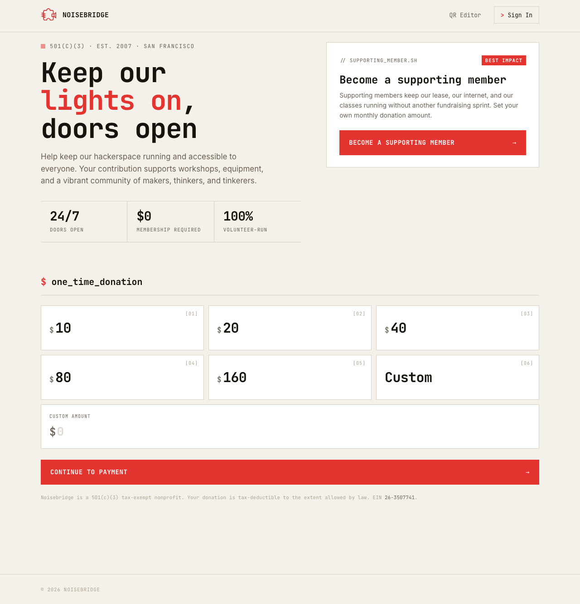

# donate.noisebridge.net

Donation portal for Noisebridge hackerspace.



## Setup

### Install Bun

```bash
curl -fsSL https://bun.sh/install | bash
```

### Install dependencies

```bash
bun install
bunx playwright install firefox
```

### Set up `.env` file

Create a `.env` file in the root of the repository with the following variables:

* `SERVER_HOST` - `127.0.0.1:3000` for local dev
* `DISABLE_RATE_LIMIT` - `true` for local dev and e2e tests
* `STRIPE_SECRET` - Get a Stripe test key for local dev
* `STRIPE_PORTAL_CONFIG` - ID like `bpc_...` from `./scripts/stripe-setup.ts`
* `STRIPE_WEBHOOK_SECRET` - Get from `stripe listen --forward-to localhost:3000/webhook`
* `GITHUB_CLIENT_ID` - Create an OAuth app on Github
* `GITHUB_SECRET` - Create an OAuth app on Github
* `GOOGLE_CLIENT_ID` - Create an OAuth app in the Google Cloud Console
* `GOOGLE_SECRET` - Create an OAuth app in the Google Cloud Console
* `RESEND_KEY` - From https://resend.com
* `EMAIL_SENDER` - Where to send emails from (defaults to `onboarding@resend.dev`)
* `COOKIE_SECRET` - Randomly generated string
* `TOTP_SECRET` - Randomly generated string

### Run setup script

```shell
bun run stripe-setup
```

## Development

### Run!

```bash
bun run dev
```

### Test!

```bash
bun run test
bun run test:e2e
```

### Format & Lint!

```bash
bun run lint:fix
```

## License

AGPLv3
